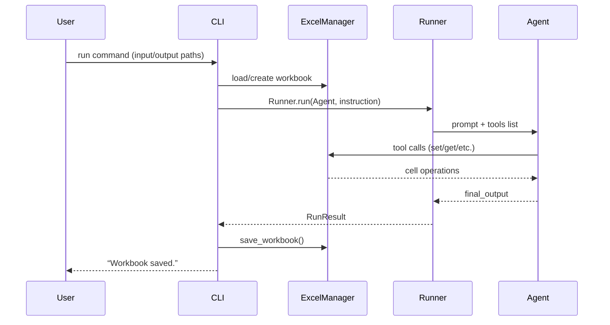
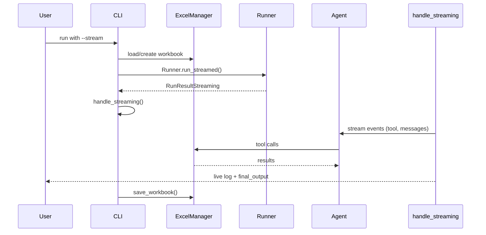
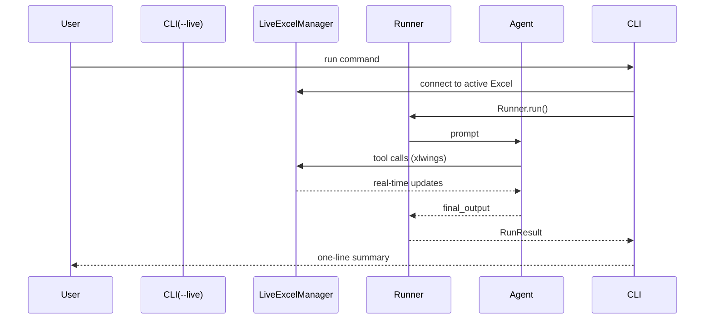
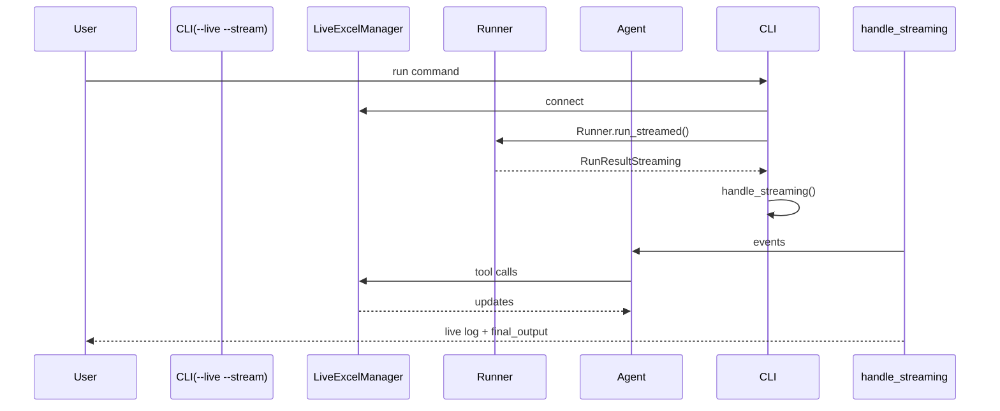
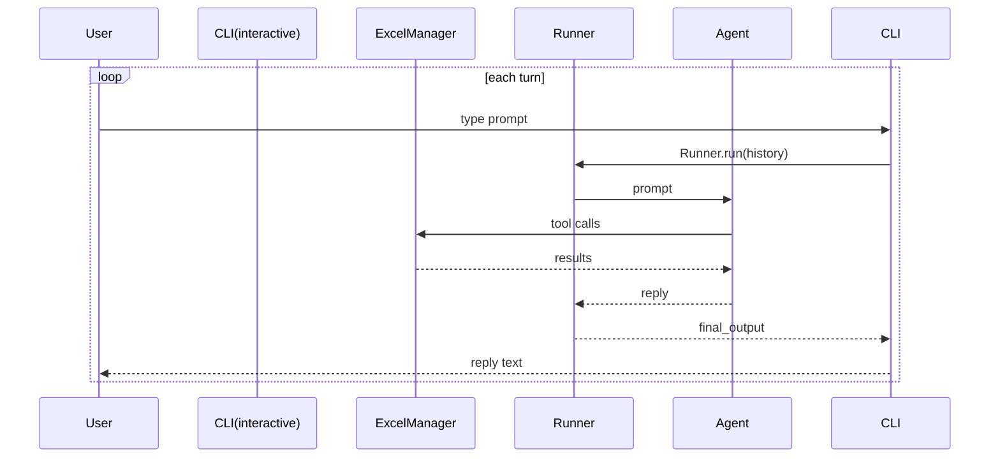
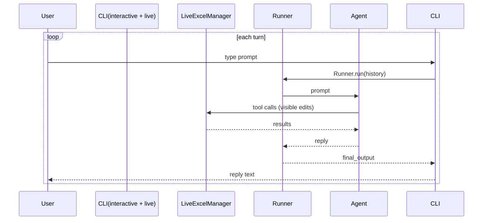

**Journeys exposed by `excel_assistant_agent`**

1. **Batch‑headless** – CLI → `ExcelManager` → `Runner.run` → save workbook  
2. **Batch‑headless + stream** – CLI → `ExcelManager` → `Runner.run_streamed` → `handle_streaming` → save workbook  
3. **Live Excel** – CLI `--live` → `LiveExcelManager` (xlwings) → `Runner.run` (real‑time edits)  
4. **Live Excel + stream** – CLI `--live --stream` → `LiveExcelManager` → `Runner.run_streamed` → `handle_streaming`  
5. **Interactive chat** – CLI `--interactive` loop → `ExcelManager` → `Runner.run` per turn  
6. **Interactive chat + live** – CLI `--interactive --live` loop → `LiveExcelManager` → `Runner.run` per turn  

---

### 1 · Batch‑headless

### 2 · Batch‑headless + stream

### 3 · Live Excel

### 4 · Live Excel + stream

### 5 · Interactive chat

### 6 · Interactive chat + live

